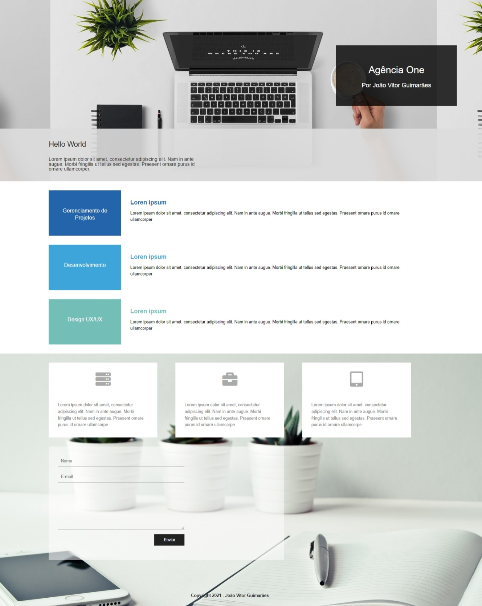

# Curso Udemy: Bootstrap 5 do Básico ao Avançado (com 4 Projetos)

[Bootstrap 5 do Básico ao Avançado](https://anima.udemy.com/course/bootstrap-5-do-basico-ao-avancado-com-4-projetos/)

## Capítulo: Projeto 4 - Agência (HTML e CSS Puros)

## Screenshots 

### Aulas:

1. **Introdução do Projeto:**
   - Iniciando com uma apresentação do projeto Agência e uma visão geral do que será abordado.

2. **Iniciando o Projeto:**
   - Preparando o ambiente e dando os primeiros passos no desenvolvimento do projeto.

3. **Criando o HTML do Header:**
   - Desenvolvendo o HTML para a seção de cabeçalho da página da agência.

4. **Finalizando o CSS do Header:**
   - Concluindo o estilo CSS para a seção de cabeçalho, garantindo um design atraente e responsivo.

5. **Construindo HTML de Serviços:**
   - Implementando o HTML para a seção que exibirá os serviços oferecidos pela agência.

6. **CSS da Área de Serviços:**
   - Desenvolvendo o estilo CSS para a área de serviços, proporcionando uma apresentação visual atraente.

7. **HTML da Sessão de Especialidades:**
   - Criando o HTML para a seção destacando as especialidades da agência.

8. **CSS da Sessão de Especialidades:**
   - Estilizando a sessão de especialidades para garantir uma apresentação visual coerente com o restante do projeto.

9. **HTML do Formulário:**
   - Desenvolvendo o formulário de contato utilizando HTML.

10. **CSS do Formulário:**
    - Estilizando o formulário de contato, tornando-o atraente e funcional.

11. **Conclusão do Projeto:**
    - Encerramento do projeto Agência, revisão do que foi aprendido e possíveis próximos passos.
