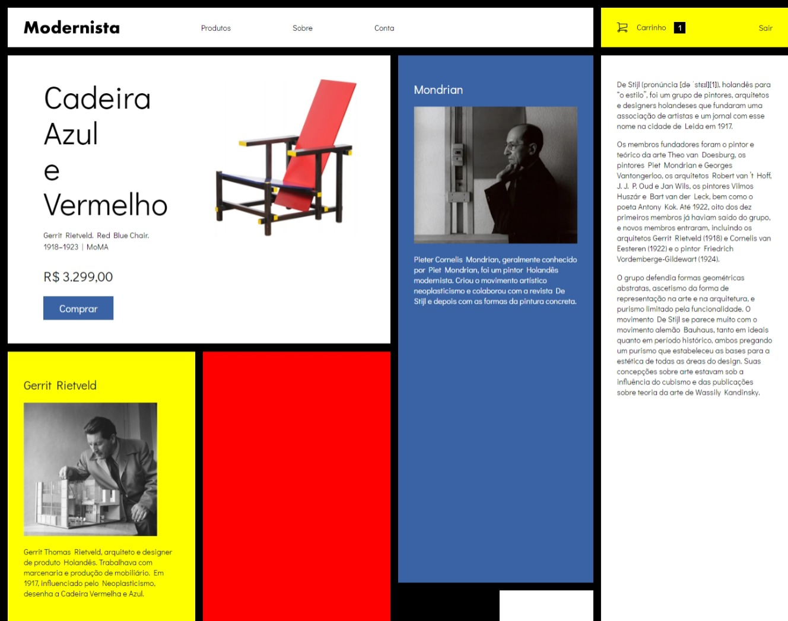

# [UDEMY]CSS Avançado - Sass, CSS Grid Layout e CSS Modules

## Projeto de AprendizadoCSS Grid Layout

Este repositório contém os materiais e códigos das aulas do curso "CSS Avançado - Sass, CSS Grid Layout e CSS Modules" da Udemy. Neste curso, exploramos diversos conceitos avançados de CSS, com foco especial em CSS Grid Layout.

## Sobre o Curso

**Curso:** [CSS Avançado - Sass, CSS Grid Layout e CSS Modules](https://www.udemy.com/course/css-avancado/)

## Screenshot

## Aulas sobre CSS Grid

### 7. CSS Grid - Apresentando o Layout
Nesta aula, introduzimos os conceitos básicos do CSS Grid e explicamos como ele pode ser usado para criar layouts complexos e responsivos.

### 8. CSS Grid - Estrutura do HTML
Abordamos a estrutura recomendada do HTML ao trabalhar com CSS Grid, garantindo uma base sólida para o layout.

### 9. CSS Grid - Grid Template Columns
Exploramos a propriedade `grid-template-columns` e como ela pode ser utilizada para definir as colunas do layout.

### 10. Grid - Grid Template Rows e Auto Rows
Damos continuidade ao entendimento do CSS Grid, agora focando na definição de linhas usando `grid-template-rows` e automação de linhas com `auto-rows`.

### 11. CSS Grid - Melhorando Ferramentas de Trabalho
Apresentamos ferramentas e dicas úteis para aprimorar a eficiência ao trabalhar com CSS Grid.

### 12. CSS Grid - Grid-Colum e Grid-Row
Aprofundamos os conhecimentos sobre a disposição de colunas e linhas usando `grid-column` e `grid-row`.

### 13. CSS Grid - Align e Justify Items
Discutimos as propriedades `align-items` e `justify-items` para posicionar itens dentro das células da grade.

### 14. CSS Grid - Ajustando Conteúdo na Grid
Detalhamos técnicas para ajustar e posicionar conteúdo dentro das células da grade.

### 15. CSS Grid - Fazendo o Banner
Demonstramos como criar um banner atraente usando as capacidades avançadas do CSS Grid.

### 16. CSS Grid - Organizando Textos e Imagens
Exploramos estratégias para organizar e alinhar textos e imagens em layouts complexos.

### 17. CSS Grid - Ajustando Conteúdo Verticalmente
Abordamos técnicas específicas para ajustar o conteúdo verticalmente dentro das células da grade.

### 18. CSS Grid - Grid Template Areas
Apresentamos o poderoso recurso de `grid-template-areas` para organizar o layout de forma mais intuitiva e visual.

### 19. CSS Grid - Intro Exercicio CSS Grid 02
 - Auto Fit, Auto Fill e Span
Iniciamos um exercício prático explorando `auto-fit`, `auto-fill` e a propriedade `span` para criar layouts dinâmicos.

### 21. CSS Grid - MinMax
Aprofundamos os conhecimentos sobre `minmax` para criar layouts flexíveis e adaptáveis.

### 22. CSS Grid - Autoflow Dense
Demonstramos como usar `autoflow dense` para otimizar o espaço e organizar itens de maneira mais compacta.

### 23. CSS Grid - Finalizando Galeria com Dense
Concluímos a criação de uma galeria utilizando `dense` para obter um layout final otimizado.
